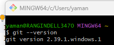

# Git Learning

### **Installation**
- Install [Git Client](https://git-scm.com/download/win), launch 'Git Bash' tool, and run
`git --version`

- Install Git Tools such as _GitKraken_, _SourceTree_ or [_GitHubDeskTop_](https://desktop.github.com/)
    - Create a free account at [GitHub](www.github.com) to create and manage your personal repositories
### **Settings**
- After git client is installed, run the following commands to the settings.

    `git config color.ui true`
    `git config format.pretty oneline`
    `git config --list --show-origin`
    `git config --global user.name "Your Name"`
    `git config --global user.email "Your Account ID"`

### Notes
By Default, a developer works on a directory AKA Working Directory or Working Tree. e.g.: **_git_learning_**

### Commands
To **create (initiate) a new Git Repository** in Local machine: It will create '.git' directory under WorkingTree/Directory

`git init`

To **Uninitialize (remove) a Git Repo** in Local machine, navigate to repo directory (e.g. cd /...../.../workindir/)
   
 `rm -rf .git`

To **download/clone an existing remote Git Repo** 
    
`git clone <remote URL>`

 e.g.: `git clone  https://github.com/<accoutname>/<reponame>.git>`

To **Stage only one file from the current WorkingTree**

`git add <filename>` 

To **Remove a file from Stage(Index)**

`git rm --cached <filename>`  or `git restore --staged <filename>`

To **Stage all (added, modified, deleted) files from the current WorkingTree**

`git add -A` (git add --all)

To **Commit all the Staged files in Local Repo**

`git commit -m "Commit Message Here"`

To **Commit all modified files

To **Stage all (added, modified and deleted) files and commit**

`git add -A && git commit -m "Commit Message here"`

To **Push the committed files from Local Repo to Remote Rep**

`git push`

To **Modify the comment of last commit and push into remote repo**

<strong>Extra Careful:</strong>  Assuming no local changes existing,  run the following commands

 - Pull all the changes from Remote to local
 `git pull`
 - Modify the comment of last commit
 `git commit --amend -m "New Commit Message Here"`
 - Push the change Forcefully to remote branch
 `git push --force origin <remote branch name>`

To **Undo most recent commit**

`git reset HEAD~1`

To **Revert to specific commit**

`git revert <SHACODE>`

#### Additional Materials
- [Git for beginners: The definitive practical guide](https://stackoverflow.com/q/315911/12860895)
- [Resources to learn Git](https://try.github.io/)
- [Learn Git Branching](https://learngitbranching.js.org/)
- [Explain Git With D3](https://onlywei.github.io/explain-git-with-d3)