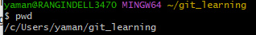

# Git Learning

## **Installation**
- Install [Git Client](https://git-scm.com/download/win), launch 'Git Bash' tool, and run

  `git --version` 
  
  _Output:_ git version 2.39.2.windows.1

- Install Git Tools such as _GitKraken_, _SourceTree_ or [_GitHubDeskTop_](https://desktop.github.com/)
    - Create a free account at [GitHub](www.github.com) to create and manage your personal repositories

## **Settings**
After git client is installed, run the following commands to the settings which will get added to _<user-home>/.gitconfig_

    git config color.ui true
    git config format.pretty oneline
    git config --list --show-origin
    git config --global user.name "Your Name"
    git config --global user.email "Your Account ID"

## Notes
By Default, a developer works on a directory AKA Working Directory or Working Tree. e.g.: **_git_learning_**

Note that **.git** directory is created under 'git_learning' WorkingTree,
## Initialize/Create/Add/Remove Commands
***
To **create (initiate) a new Git Repository** in Local machine: It will create '.git' directory under WorkingTree/Directory

`git init`

To **Uninitialize (remove) a Git Repo** in Local machine, navigate to repo directory (e.g. cd /...../.../workingdirORTree/)
   
 `rm -rf .git`

To **download/clone an existing remote Git Repo** 
    
`git clone <remote URL>`

 e.g.: `git clone  https://github.com/<accoutname>/<reponame>.git>`

To **Add a change in the WorkingTree(Working Directory) to Git's Stage(Index)**

`git add <filename>` 

To **Remove a file from Stage(Index)**

`git reset .` OR `git rm --cached <filename>` OR `git rm -r --cached <filename>` OR  `git restore --staged <filename>`

To **Stage all (added, modified, deleted) files from the current WorkingTree**

`git add -A` (git add --all)

## Commit commands
***

To **Commit all the Staged files in Local Repo**

`git commit -m "Commit Message Here"`

To **Commit all modified files

To **Stage all (added, modified and deleted) files and commit**

`git add -A && git commit -m "Commit Message here"`

## Push commands (To push all changes to from local repo to Remote repo)
***
To **Push the committed files from Local Repo to Remote Rep**

`git push`

To **Modify the comment of last commit and push into remote repo**

<strong>Extra Careful:</strong>  Assuming no local changes existing,  run the following commands

  - Modify the **last commit message**
  
    a. Pull all the changes from Remote to local: `git pull`
  
    b. Modify the comment of last commit : `git commit --amend -m "New Commit Message Here"`
  
    c. Push the change Forcefully to remote branch : `git push --force origin <remote branch name>`
  
  - Modify **(add a new file) to the last commit**
  
    a. Add the file: `git add <filename>`
  
    b. Amend the last commit with **same message** :  `git commit --amend --no-edit`
  
    c. Push the change Forcefully to remote branch : `git push --force origin <remote branch name>`

## Undo/Restore/Revert
***
To **Undo most recent commit**

`git reset HEAD~1`

To **Revert to specific commit**

`git revert <SHACODE>`

To **Hard Reset the local branch to look like Remote branch**

`git fetch origin && git reset --hard origin/<remote-branch-name> && git pull && git status -sb` 

OR  

`git clean -d -i -f && git reset --hard origin/<remote-branch-name>`

To **Remove all the local changes and reset to local Head**

`git reset --hard HEAD`

# Practice Git Commands on existing Repository

## **Clone a branch of a remote Git repository into local machine**
1. Clone the 'main' branch from remote git repo, [git_learning](https://github.com/amanmrangin/git_learning/) into local developer machine
   - Open *Git Bash* app, Navigate to any working directory (e.g: IdeaProjects) of your choice in your local machine.
     ` cd ~/IdeaProjects/`
   - **Clone** the remote repo into local WorkingDirectory or WorkingTree
     `git clone https://github.com/amanmrangin/git_learning.git`
   -  **Pull** all the changes from 'main' branch of remote repo into local WorkingDirectory
      `git pull`
   - **Fetch** all the existing branches from remote repo into local WorkingDirectory
     `git fetch`
     -  View all the available remote branches of the repo: `git branch -r`
     
          . 
   - Notice that there 4 branches available in remote repo
      
     - **main**
       -    |--**dev1_feature_1** (Created for a developer1 to work only on _Feature_1_)
       -    |--**dev2_feature_2** (Created for a developer2 to work only on _Feature_2_)
       -    |--**release_1** (Created to have both _Feature_1_ and _Feature_2_ merged for the _Release_1_)
   
   -  Ignore the structure of other files/folders, focus only on 'git_learning/exercise-1/' directory where the following git operations will be performed.  The current structure of 'git_learning\exercise_1' directory looks like below 
      
   - Notice that there are already 3 files available in remote repository under 'main' branch

Let's get into practicing now!
   
## **As a developer1, work on 'dev1_feature_1' branch to implement a feature**
1. **Switch** to work on _dev1_feature_1_ branch, **Pull** the code, and verify the **Status**
   `git checkout dev1_feature_1 && git pull && git status -sb`

2. Create a new file, file4.txt, and add the following text, "This is line 1 of file4", save/close the file.

3. Verify that 'file4.txt' is a new file that is Untracked/Un-versioned (**??**) means not being added to Stage (index) of Git
    `git staus -sb`
 
    

4.  Create a new file, file5.txt, and add the following text, "This is line 1 of file5", save/close the file.
  `git add file5.txt`
5.  Add 'file5.txt' to Stage(index) of Git. Notice that **A** before file5.txt indicates that the file is being tracked/versioned by Git

    

6. Modify the existing 'r_file_a.txt': Open 'r_file_a.txt', and Save and Close the file. 

   

7. Delete an existing 'r_file_b.txt': Remove the file 'r_file_b.txt'. Verify the Status.
    `rm -rf r_file_b.txt`
    `git status -sb`

    

8. Create a new 'file6.txt', add some content, and add to Stage(index) of Git, and commit to local git repo.
    `git add file6.txt` and `git commit file6.txt`

9 Run `git status -sb` and notice the output

     **A** indicates that a new file is being added (staged/index) and tracked by git
     **??** indicates that a new file is being added to WorkingDirectory, not added (staged/index) and tracked by Git
     **M** indicates that an existing remote file is being modified in local repo
     **D** indicates that an existing remote file is being deleted in local repo

10. Run `git status` and notice the output

## **Restore (undo), Reset or Revert Commands**
   - Git Restore: Restore(undo) the files in Working Directory: `git restore <filename> will remove the modifications
   - Git Reset: Rollbacks the changes in local Working Directory to specific commit. [Read more](https://opensource.com/article/18/6/git-reset-revert-rebase-commands)
      - `git reset <SHA1>`
      - Hard Reset: To Reset/Orvewrites all the contents of local (local repository, local staging/index area and local working directory) to the remote, `git reset --hard <remote branch name> ` OR `git reset --hard <SHA1Code>` OR `git reset --hard HEAD`
   - Git Revert: Adds a new commit to the history. `git revert HEAD` or `git revert <SHA1Code>`.  NOTE: Use _Revert_ if already commits are already pushed to remote repository and other developers may have pulled the code.
  
  
##  **Merge Commands**
   ### Merge 'main' or 'master' branches change into a 'feature' branch
   - Ensure local developer machine has the latest **main** or **master** branch
   `git checkout main` && `git pull`
   - Ensure local developer machine has the latest *dev1_feature_1* branch
   `git checkout feature1_branch` && `git pull`
   - Merge the local **dev1_feature_1** with local **main** branch 
   `git merge main`
   - Compare the changes and resolve the conflicts before Pushing the local **dev1_feature_1** to remote **feature1_branch
   `git push`

  ### Squash and Merge (Multiple Commits of one branch as one large commit into another branch)
***
To **Merge the code (multiple commits and multiple files) from 'dev_feature_1' branch into 'release_1' branch**

**Assumptions**: No other developer is working on these 2 branches while you are merging in your local machine
- **Prepare in Local machine**
    1. Verify that 'dev_feature_1' branch in local machine does NOT have any changes
    2. Pull all the changes from remote 'dev_feature_1' branch to local machine: `git checkout dev_feature_1 && git pull && git status -sb`
    3. Switch your local workspace to target (release_1) branch:   `git checkout release_1 && git pull && git status -sb`

- **Merge in Local machine**
    1. ake all commits from 'dev_feature_1' branch, squash them as one single commit and merge them into 'release_1' branch `git merge --squash dev_feature_1`
    2. Resolve all the merge conflicts in local machine if there are any
- **Commit in Local Machine**
    1. Commit the changes to 'release_1': `git commit`
- **Push changes from Local to Remote**
    1.  `git push`
- **Verify** the commit history on the remote 'release_1' branch

## Additional Materials
- [Git for beginners: The definitive practical guide](https://stackoverflow.com/q/315911/12860895)
- [Resources to learn Git](https://try.github.io/)
- [Learn Git Branching](https://learngitbranching.js.org/)
- [Explain Git With D3](https://onlywei.github.io/explain-git-with-d3)
