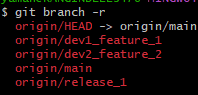
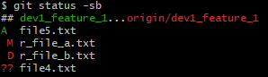
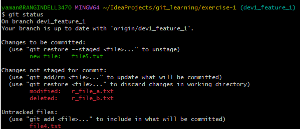

# Practice Git Commands

## **Clone a branch of a remote Git repository into local machine**
1. Clone the 'main' branch from remote git repo, [git_learning](https://github.com/amanmrangin/git_learning/) into
   - Open *Git Bash* app, Navigate to any working directory (e.g: IdeaProjects) of your choice in your local machine.
     ` cd ~/IdeaProjects/`
   - **Clone** the remote repo into local WorkingDirectory or WorkingTree
     `git clone https://github.com/amanmrangin/git_learning.git`
   -  **Pull** all the changes from 'main' branch of remote repo into local WorkingDirectory
      `git pull`
   - **Fetch** all the existing branches from remote repo into local WorkingDirectory
     `git fetch`
     -  View all the available remote branches of the repo: `git branch -r`
     
          . 
   - Notice that there 4 branches available in remote repo
      
     - **main**
       -    |--**dev1_feature_1** (Created for a developer1 to work only on _Feature_1_)
       -    |--**dev2_feature_2** (Created for a developer2 to work only on _Feature_2_)
       -    |--**release_1** (Created to have both _Feature_1_ and _Feature_2_ merged for the _Release_1_)
   
   -  Ignore the structure of other files/folders, focus only on 'git_learning/exercise-1/' directory where the following git operations will be performed.  The current structure of 'git_learning\exercise_1' directory looks like below 
      
   - Notice that there are already 3 files available in remote repository under 'main' branch

Let's get into practicing now!
   
###  As a developer1, work on 'dev1_feature_1' branch to implement a feature
1. **Switch** to work on _dev1_feature_1_ branch, **Pull** the code, and verify the **Status**
   `git checkout dev1_feature_1 && git pull && git status -sb`

2. Create a new file, file4.txt, and add the following text, "This is line 1 of file4", save/close the file.

3. Verify that 'file4.txt' is a new file that is Untracked/Un-versioned (**??**) means not being added to Stage (index) of Git
    `git staus -sb`
 
    

4.  Create a new file, file5.txt, and add the following text, "This is line 1 of file5", save/close the file.
  `git add file5.txt`
5.  Add 'file5.txt' to Stage(index) of Git. Notice that **A** before file5.txt indicates that the file is being tracked/versioned by Git

    

6. Modify the existing 'r_file_a.txt': Open 'r_file_a.txt', and Save and Close the file. 

   

7. Delete an existing 'r_file_b.txt': Remove the file 'r_file_b.txt'. Verify the Status.
    `rm -rf r_file_b.txt`
    `git status -sb`

    

8. Create a new 'file6.txt', add some content, and add to Stage(index) of Git, and commit to local git repo.
    `git add file6.txt` and `git commit file6.txt`

9 Run `git status -sb` and notice the output

     **A** indicates that a new file is being added (staged/index) and tracked by git
     **??** indicates that a new file is being added to WorkingDirectory, not added (staged/index) and tracked by Git
     **M** indicates that an existing remote file is being modified in local repo
     **D** indicates that an existing remote file is being deleted in local repo

10. Run `git status` and notice the output

### Restore or Reset Commands
    
   
###  Merge Commands
   #### Merge 'main' or 'master' branches change into a 'feature' branch
   - Ensure local developer machine has the latest **main** or **master** branch
   `git checkout main` && `git pull`
   - Ensure local developer machine has the latest *dev1_feature_1* branch
   `git checkout feature1_branch` && `git pull`
   - Merge the local **dev1_feature_1** with local **main** branch
   `git merge main`
   - Compare the changes and resolve the conflicts before Pushing the local **dev1_feature_1** to remote **feature1_branch
   `git push`
