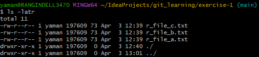

# Practice Git Commands

## **Clone a branch of a remote Git repository into local machine**
1. Clone the 'main' branch from remote git repo, [git_learning](https://github.com/amanmrangin/git_learning/) into
   - Open *Git Bash* app, Navigate to any working directory (e.g: IdeaProjects) of your choice in your local machine.
     ` cd ~/IdeaProjects/`
   - **Clone** the remote repo into local WorkingDirectory or WorkingTree
     `git clone https://github.com/amanmrangin/git_learning.git`
   -  **Pull** all the changes from 'main' branch of remote repo into local WorkingDirectory
      `git pull`
   - **Fetch** all the existing branches from remote repo into local WorkingDirectory
     `git fetch`
     -  View all the available remote branches of the repo: `git branch -r`
     
          . 
   - Notice that there 4 branches available in remote repo
      
     - **main**
       -    |--**dev1_feature_1** (Created for a developer1 to work only on _Feature_1_)
       -    |--**dev2_feature_2** (Created for a developer2 to work only on _Feature_2_)
       -    |--**release_1** (Created to have both _Feature_1_ and _Feature_2_ merged for the _Release_1_)
   
   -  Ignore the structure of other files/folders, focus only on 'git_learning/exercise-1/' directory where the following git operations will be performed.  The current structure of 'git_learning\exercise_1' directory looks like below 
      
   - Notice that there are already 3 files available in remote repository under 'main' branch

Let's get into practicing now!
   
###  As a developer1
1. **Switch** to work on _dev1_feature_1_ branch, **Pull** the code, and verify the **Status**
   `git checkout dev1_feature_1 && git pull && git status -sb`

2. 
1. Navigate to existing directory: `cd exercise-1`
   -  Verify the status by running `git status -sb` 
   
      

2. Create a new file (file1.txt) with any editor your choice or command (e.g nano file1.txt):
   `nano file1.txt`
   - Add a new line: "_This is line 1 of file1.txt_" and close the file1.txt
   - Verify the status by running `git status -sb` 
  
     
   - Notice that **_??_** before _file1.txt_ indicates that _file1.txt_ is a new file and untracked by Git

3. Add a new (untracked/un-versioned by Git) 'file1.txt' from Working Directory (Working Tree) to local git Stage(Index)
   `git add file1.txt`

   - The above command has added a **new** untracked/un-versioned file (file1.txt) from local _exercise-1_ directory to local git repo stage directory (<project-root-dir>/.git/index)
   - Verify the status by running `git status -sb` 
      
   - Notice that **_A_** before _file1.txt_ indicates that file is **A**dded to Git Index (<project-root-dir>/.git/index) for tracking/versioning

4. Remove (untracked/un-versioned) a newly added (tracked/versioned) file 'file1.txt' from local git Stage(Index), (<project-root-dir>/.git/index):
   `git reset file1.txt`
   - Verify the status by running `git status -sb` 
   
     
   - Notice that **_??_** before _file1.txt_ indicates that _file1.txt_ is a new file and untracked by Git

5. 
    
   
###  Merge Commands
   #### Merge 'main' or 'master' branches change into a 'feature' branch
   - Ensure local developer machine has the latest **main** or **master** branch
   `git checkout main` && `git pull`
   - Ensure local developer machine has the latest *feature1_branch* branch
   `git checkout feature1_branch`
   - Merge the local **feature1_branch** with local **main** branch
   `git merge main`
   - Push the local **feature1_branch** to remote **feature1_branch
   `git push`
